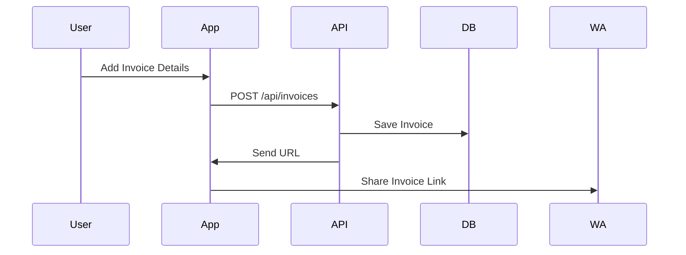

<div align="center">
  <h1>🧾 NAARI FABS - Professional GST Billing App</h1>
  <p><strong>Complete Full-Stack Mobile GST Billing Solution for Textile Businesses</strong></p>

  
  
  
  
  
  

  

  <p>A comprehensive mobile application designed for GST-compliant invoicing with automated PDF generation, WhatsApp sharing, and secure cloud integration.</p>

  
</div>

---

## 📱 About NAARI FABS
**NAARI FABS** is a premium textile brand specializing in handloom and designer collections. This app digitalizes their billing process for speed and professionalism.

> *"House of Designer Collections for every occasion"*

---

## 🚀 Features
- ✅ Customer Management & Manual Invoice Numbering
- ✅ GST-Compliant PDF Invoices & HSN Code Database
- ✅ WhatsApp Integration & Offline Support
- ✅ Dynamic GST Calculations & Duplicate Prevention

---

## 🏗 Architecture


---

## 📊 System Flow


---

## 🗄 Database Schema
```mermaid
erDiagram
Customer ||--o{ Invoice : has many
Invoice ||--o{ InvoiceItem : contains
```

---

## 🛠 Tech Stack
**Frontend**: React Native
**Backend**: Node.js, Express
**Database**: MongoDB Atlas
**Tools**: PDFKit, Render, Android Studio

---

## 📱 Screenshots
<div align="center">
<table>
<tr>
<td><br><strong>Customer Management</strong></td>
<td><br><strong>Invoice Generation</strong></td>
<td><br><strong>PDF Output</strong></td>
</tr>
</table>
</div>

---

## ⚡ Quick Start
```bash
git clone https://github.com/kushagrakartikeye/Tax-Invoice-generator.git
cd Tax-Invoice-generator
npm install
npm start
npm run android
```
Add `.env`:
```
MONGODB_URI=your_mongodb_uri
PORT=3001
```

---

## 📋 API Endpoints
- POST /api/invoices
- GET /api/customers/:date

---

## 🎯 Roadmap
✔ Multi-language | Inventory | Analytics
✔ iOS Support | Multi-store Management

---

## 📞 Contact
📱 +91-9891388165 | 📧 naarionlinesale@gmail.com
**Developer**: [Kushagra Kartikeye](https://github.com/kushagrakartikeye)

---

<div align="center">
⭐ Star this repo if you found it helpful!
<br>
 
</div>
