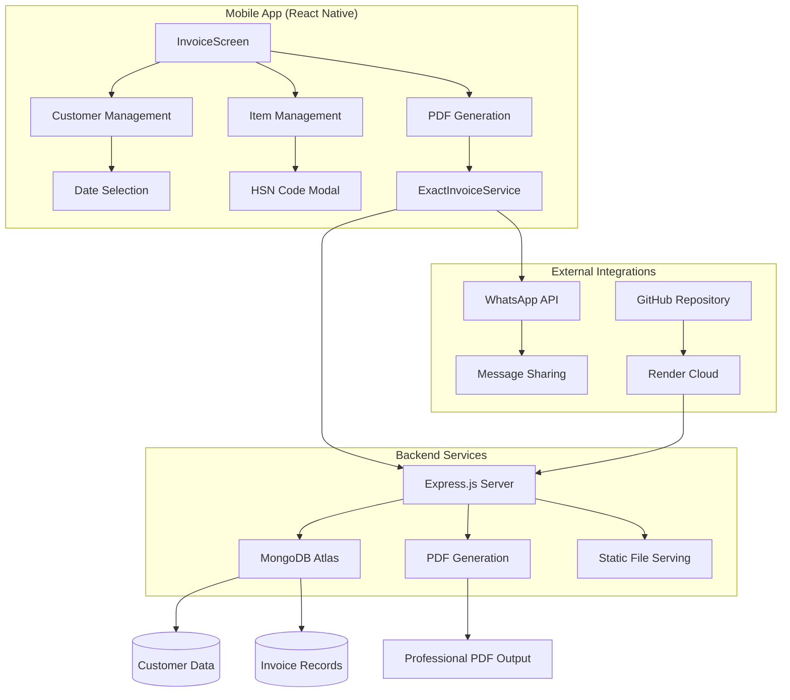
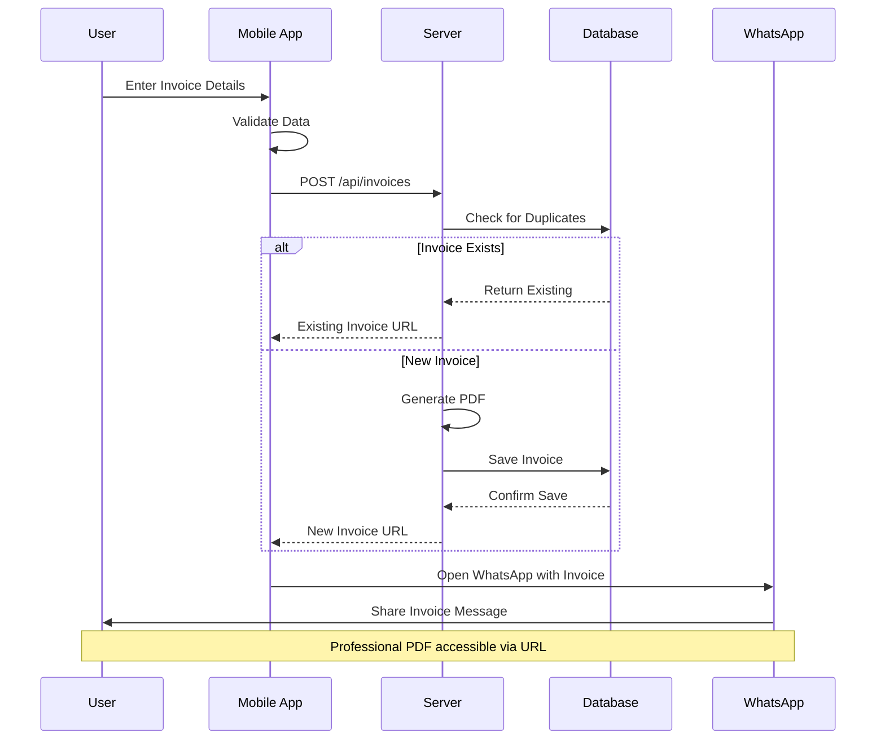

```markdown
<div align="center">
  <h1>🧾 NAARI FABS - Professional GST Billing App</h1>
  <p><strong>Complete Full-Stack Mobile GST Billing Solution for Textile Businesses</strong></p>

  
  
  
  
  
  

  <p>A comprehensive mobile application designed specifically for textile businesses to generate professional GST-compliant invoices with automated PDF generation, WhatsApp integration, and cloud database management.</p>

  
</div>

---

## 📱 About NAARI FABS

**NAARI FABS** is a house of designer collections specializing in premium handloom and designer textiles. This application was built to streamline their billing process and provide professional invoice management for their growing business.

> *"House of ladies' Designer Collections - Unique designer collections for every occasion"*

---

## 🚀 Features

### 💼 **Business Management**
- ✅ **Customer Management** - Date-wise customer organization
- ✅ **Professional Invoice Generation** - GST-compliant PDF invoices
- ✅ **Manual Invoice Numbering** - Custom invoice number control
- ✅ **Duplicate Prevention** - Smart database integrity
- ✅ **Item-wise Discounts** - Advanced discount calculations
- ✅ **Dynamic GST Rates** - Support for 5%, 12%, 18% GST

### 📄 **Invoice Features**
- ✅ **Professional PDF Generation** - High-quality, branded invoices
- ✅ **Complete HSN Code Database** - Textile industry compliance
- ✅ **Real-time Calculations** - Automatic tax and discount calculations
- ✅ **Company Branding** - Professional NAARI FABS identity
- ✅ **Terms & Conditions** - Built-in business policies

### 📱 **Digital Integration**
- ✅ **WhatsApp Integration** - Direct invoice sharing
- ✅ **Cloud Database** - MongoDB Atlas integration
- ✅ **Local Storage** - Offline invoice access
- ✅ **Mobile-First Design** - Optimized for Android devices

---

## 🏗️ Architecture Overview



---

## 📊 System Flow



---

## 🛠️ Technology Stack

**Frontend**: React Native, React Native Paper, JavaScript  
**Backend**: Node.js, Express.js, MongoDB Atlas  
**Tools & Services**: PDFKit, Render, Android Studio

---

## ⚡ Quick Start

### Prerequisites
- Node.js (v18 or higher)
- React Native CLI
- Android Studio with SDK
- Java JDK 11 or higher

### Installation
```bash
git clone https://github.com/kushagrakartikeye/Tax-Invoice-generator.git
cd Tax-Invoice-generator
npm install
npm start
npm run android
```

### Environment Variables
Create a `.env` in the backend directory:
```
MONGODB_URI=your_mongodb_connection_string
PORT=3001
NODE_ENV=production
```

---

## 📋 API Documentation
- **GET** /api/customers/:year/:month/:day
- **POST** /api/customers
- **POST** /api/invoices
- **GET** /invoices/:filename

Example Invoice:
```json
{
  "customerName": "John Doe",
  "customerPhone": "9876543210",
  "invoiceNumber": "INV-001",
  "items": [
    {
      "productName": "Cotton Saree",
      "hsn": "520811",
      "quantity": 2,
      "unitPrice": 1500,
      "discountPercent": 10,
      "taxable": 2700
    }
  ],
  "subtotal": 2700,
  "gstPercent": 5,
  "gst": 135,
  "total": 2835
}
```

---

## 🎯 Roadmap
- Q3 2025: Multi-language, Inventory Management
- Q4 2025: iOS Version, Analytics Dashboard
- Q1 2026: Multi-store Support, Advanced Reporting

---

## 📞 Contact
**NAARI FABS**  
📱 +91-9891388165  
📧 naarionlinesale@gmail.com  
🌐 [Website](www.naarifabs.company.site)

**Developer**  
👨‍💻 Kushagra Kartikeye  
🐙 [GitHub](https://github.com/kushagrakartikeye)

---

## 📄 License
MIT License. See [LICENSE](LICENSE).

---

<div align="center">
⭐ **Star this repository if you found it helpful!** ⭐
</div>
```
